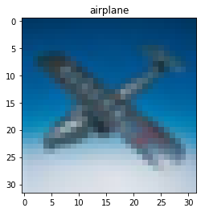

# convnets-regularization #
[Convolutional neural networks](https://en.wikipedia.org/wiki/Convolutional_neural_network) are widely used in deep learning in image classification and object recognition tasks. Deep convolutional neural networks used with large and complex images are prone to overfitting and a number of methods have been proposed to improve the regularization of such networks. In this project, recently developed regularization methods are tested to determine their effectiveness in a convolutional neural network used to classify images in the CIFAR-10 dataset.

This repository contains the code to load the CIFAR-10 dataset, define, compile, train and test the convolutional networks for classifying the CIFAR-10 images. For quick testing purposes, already trained networks of the used network architectures are included. A much more detailed full experiment report is also included.


## Data
The dataset used is the [CIFAR-10 dataset](https://www.cs.toronto.edu/~kriz/cifar.html), consisting of 60000 32x32 RGB images from 10 classes, with 6000 images per class. The training set contains 50000 images and the test set contains 10000 images. An example image from the training set is shown below.



## Tested regularization methods
The regularization methods used in this project are incrementally added to the network architecture to determine how much they improve the network generalization. The used regularization methods are:
* ##### Batch normalization
* ##### Dropout
* ##### Data augmentation


## Usage ##
The source code is contained in jupyter notebooks and a jupyter server instance should be first launched with the following command:
```sh
$ jupyter notebook
```
The source code consists of two jupyter notebooks, one for defining the network architectures and training, and the other for loading the trained networks and testing. The networks are built and trained using the Keras Python deep learning library. The full list of required Python packages is:
* `Keras 2.2.2`
* `numpy 1.15.0`
* `matplotlib 2.2.3`
* `h5py 2.8.0`
